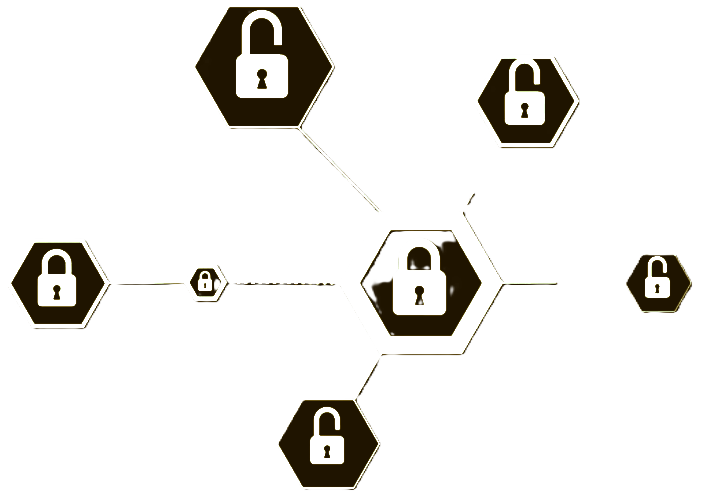

<div align="center">
  
  <h1>vue3-element-admin</h1>

  
  
  
  
</div>


## 项目简介

[隐私保护系统](https://github.com/Wanderingss/Privacy-Protection) 基于 vue3-element-admin 企业级后台管理前端模板开发的隐私保护系统前端界面。


## 项目特色

- **简洁易用**：提供了基本的图形界面内容。

## 项目启动


- **环境准备**

| 环境类型       | 名称                     |
|----------------|-----------------------------|
| **开发工具**   | [Visual Studio Code](https://code.visualstudio.com/Download) |
| **运行环境**   | Node 18 + (推荐[22.9.0](https://npmmirror.com/mirrors/node/v22.9.0/))  |
> ⚠️ 注意：Node.js 20.6.0版本存在兼容性问题，请勿使用


- **快速开始**

```bash
# 克隆代码
git clone https://github.com/Wanderingss/Privacy-Protection.git

# 切换目录
cd Privacy-Protection

# 安装 pnpm
npm install pnpm -g

# 设置镜像源(可忽略)
pnpm config set registry https://registry.npmmirror.com

# 安装依赖
pnpm install

# 启动运行
pnpm run dev
```


## 项目部署

执行 `pnpm run build` 命令后，项目将被打包并生成 `dist` 目录。接下来，将 `dist` 目录下的文件上传到服务器 `/usr/share/nginx/html` 目录下，并配置 Nginx 进行反向代理。

```bash
pnpm run build
```

以下是 Nginx 的配置示例：

```nginx
server {
    listen      80;
    server_name localhost;

    location / {
        root   /usr/share/nginx/html;
        index  index.html index.htm;
    }

    # 反向代理配置
    location /prod-api/ {
        # 请将 api.youlai.tech 替换为您的后端 API 地址，并注意保留后面的斜杠 /
        proxy_pass http://api.youlai.tech/;
    }
}
```

更多详细信息，请参考这篇文章：[Nginx 安装和配置](https://blog.csdn.net/u013737132/article/details/145667694)。

## 本地Mock

项目同时支持在线和本地 Mock 接口，默认使用线上接口，如需替换为 Mock 接口，修改文件 `.env.development` 的 `VITE_MOCK_DEV_SERVER` 为  `true` **即可**。


